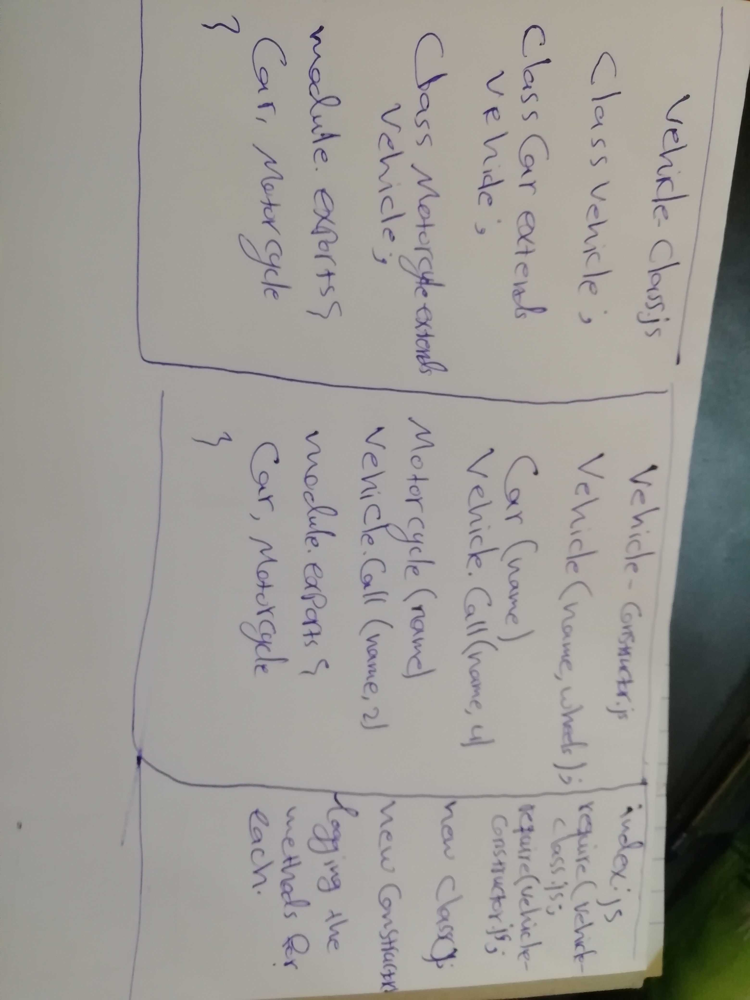

# LAB - Class 02         

## Project  Classes, Inheritance, Functionality

### Author: Naseem & Ibrahim

### Links and Resources

* [submission PR](https://github.com/naseem-401-advanced-javascript/class-02)
* [ci/cd](http://xyz.com) (GitHub Actions)

### Setup

#### How to initialize/run your application (where applicable)

* `npm start` 

#### Tests

* How do you run tests?

`npm run test` 

* Any tests of note?

nope

* Describe any tests that you did not complete, skipped, etc

#### UML

